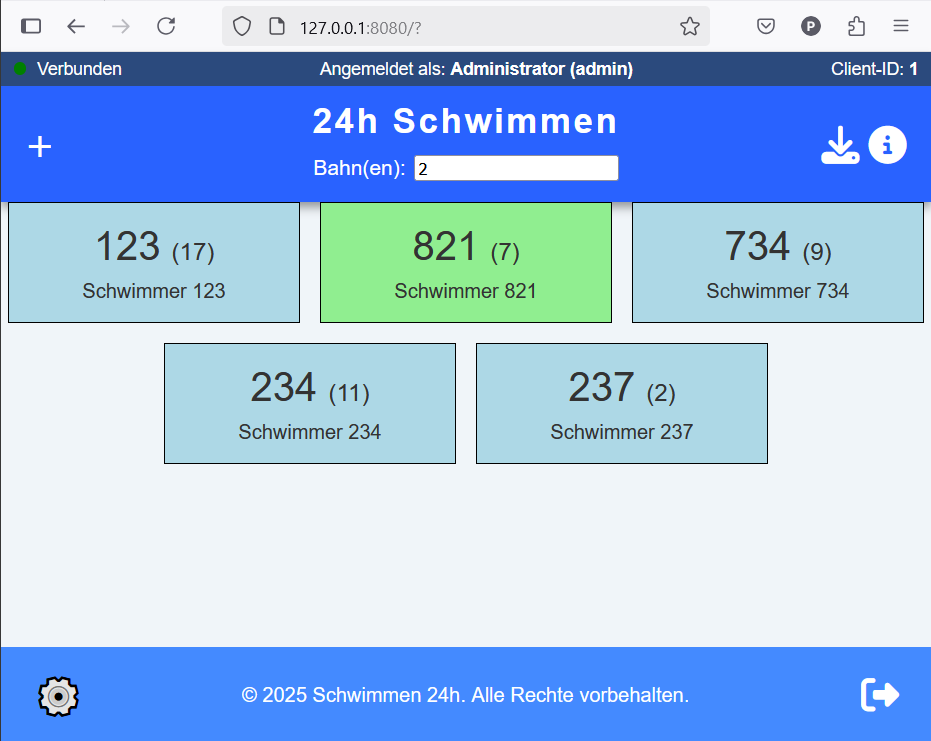

# 24h-Schwimmen

Erfassung von geleisteten Bahnen bei einem 24 Stunden schwimmen

## Szenario

Bei einem 24 Stundenschwimmen sollen digital die geleisteten Bahnen verschiedener Schiwmmer innerhalb dieser 24 Stundne auf digitalen Endgeräten erfasst und auf einem zentralen Rechner gesammelt werden.
Dabei soll die Bedienung möglichst intuitiv sein und die Datensicherheit besonders hoch, so dass selbst bei einem Ausfall des Servers oder eines Endgerätes die Informationen auf mehreren Stellen verteilt gespeichert sind.
Die Erfassung soll auf möglichst vielen verschiedenen Endgeräten möglich sein (verschiedene Bildschirmgrößen, responsive Design)

## Quick-Start

* Repository clonen.
* Dann mit ``pip install -r requirements.txt`` die benötigten Pakete installieren und
* die Datei ``server.py`` ausführen.
* Dies startet einen Web-Server auf dem Port 8080, der in der Regel unter ``http://localhost:8080`` mit dem Browser zu erreichen ist.

Eine Basisdatenbank mit dem Benutzer ``admin`` und dem Passwort ``swim24`` wird automatisch angelegt.

## grobe Planung

Ein Mini-Python-Webserver liefert eine HTML-Seite mit Javascript aus und registriert per send requests Bahnen der Schwimmer die auf einem Endgerät per klick erfasst werden. Ebenso liefert der Webserver Daten an die Webseite.

Die Gestaltung der Ansicht auf dem Endgerät ist in etwa wie folgt:

</img>

Dabei wird im oberen Bereich die Bahnnummer für die das Gerät genutzt wird angezeigt bzw. geändert. Der (+)-Button links ermöglicht es einen Schwimmer (der über seine Startnummer erfasst wird) hinzuzufügen.
In einzelnen Feldern werden die aktiv auf der Bahn schwimmenden Schwimmer angezeigt. Grün zeigt an, dass dieser Schwimmer nicht auf der eingestellten Bahn schwimmt. Die Anzeige erfolgt in der Reihenfolge, dass derjenige Schwimmer für den als letztes eine erfolgreich geschwommene Bahn registriert wurde am Ende der Liste geführt wird. So dass die vermutlich als nächstes eintreffenden aktiven Schwimmer ganz oben in der Liste geführt werden.
Nicht aktive Schwimmer werden nicht angezeigt und können über das Plus-Symbol wieder in die Liste eingefügt werden.

Durch einen Klick/Touch auf die Nummer wird eine geleistete Bahn registriert. Die Anzahl der Bahnen wird um eins erhöht und nach 3 Sekunden wird dieser Schwimmer an das Ende der Liste sortiert.
Innerhalb der drei Sekunden kann die Bahn noch zurückgenommen werden - während der Schwimmer ausgefadet wird. Der Schwimmer bleibt dann an der Stelle der Liste.

Durch einen Rechtsklick oder langen Touch auf den Schwimmer öffnet sich ein Kontextmenü in dem der Schwimmer z.B. geändert werden kann, bzw. von aktiv zu inaktiv gewechselt werden kann oder ähnliches.

## Datenmodell

Die Daten werden auf dem Server in einer SQLite Datenbank gehalten (Absturzsicher, leicht zugreifbar) und auf den Clients jeweils regelmäßig als JSON-Datei gespeichert.

### Benutzer

```text
    name: String
    benutzername: String
    passwort: String (verschlüsselt)
    admin: Boolean
```

### Client

```text
    id: Integer (beginnt bei 1)
    ip: String
    benutzer: Verweis auf Benutzer
    letzteÜbermittelteAction: Verweis auf Action
```

### Schwimmer

```text
    nummer: Integer
    erstelltVonClientId: Verweis auf Client (0 ist admin/Server)
    name: String
    bahnen: Integer (Anzahl)
    strecke: Integer (Meter)
    aufBahn: Integer (letzte Aktive Bahn - sonst 0)
    aktiv: Boolean
```

### Action (alle Befehle/Transaktionen werden protokolliert)

```text
    id: Integer (Nr muss nur lokal eindeutig sein - auf Client oder Server)
    benutzer: Verweis auf auslösenden Benutzer
    client: Verweis auf auslösenden Client
    zeitstempel: ISO-Zeitstempel
    kommando: String (BAHN, ...)
    parameterliste: Array
```

mögliche Kommandos

```text
    ADD - parameter: <schwimmerNr> <Anzahl> <bahnnr>
    SUB - parameter: <schwimmerNr> <Anzahl> <bahnnr>
    GET - parameter: <schwimmerNr>
    GETB - parameter: <bahnnummer> <bahnnummer> ...
    ACT - parameter: <schwimmerNr> <0/1>
```

mit Beispielen

```text
    ADD [832,1,1]
    SUB [732,10,2]
    GET [123]
    GET [-1] - holt alle Schwimmer
    GETB [2,3] - holt die Schwimmer der Bahnen 2,3
    ACT [123, 0] - setzt den Schwimmer Nr. 123 auf inaktiv
```

## Projektverzeichnisstruktur

Hier ist eine Übersicht über die Verzeichnisstruktur des Projektes:

```text
24H-Schwimmen/ 
├── data/               Verzeichnis für LOG-Dateien
├── flask_templates/    Vorlagen für dynmaisch generierte Webseiten
│ └── admin.html        Administrationsseite
│ └── index.html        Standardseite
│ └── login.html        Anmeldeseite 
├── static/             Dateien, die statisch ausgeliefert werden sollen
│ └── admin.js          Javascript für die Administrationsseite 
│ └── favicon.ico        
│ └── main.css          Standard-Style
│ └── main.js           Javascript der Webseite
│ └── mymodals.js       Javascript um Modals einzublenden
├── db.py               Alles was mit Datenbankzugriffen zu tun hat
├── logging_config.py   Konfiguration des Loggings
├── config.json         Konfigurationsdatei
├── server.py           Die Hauptdatei mit der Serverfunktionalität
├── utils.py            Kleine Funktionen (Hilfsfunktionen)
├── data.sqlite         Datenbank des Servers
├── README.md           dieser Text
└── requirements.txt    Für die Nutzung zu installierende Python-Module
```

## Windows-Firewall

Gegebenenfalls muss die Windows-Firewall angepasst werden. Windows-Defender-Firewall -> Erweiterete Einstellungen -> Eingehende Regel -> Neue Regel anlegen -> Port 8080 freigeben

## Git-Workflow

Neue Features / Änderungen werden in einem sinnvoll benannten Branch entwickelt.
Dabei jeweils kleinschrittig committed und schließlich per Pull Request in den Branch main gemerged.

## Git-Befehle (Beispiel)

```bash
## Neuen Branch erstellen und wechseln
git checkout -b feature/kurze-beschreibung

## Änderungen hinzufügen und committen (mehrfach und kleinschrittig)
git add .
git commit -m "Kurz und präzise beschreiben, was geändert wurde"

## Branch auf Remote pushen
git push -u origin feature/kurze-beschreibung
```

## Pull Request

Nach dem Push kann auf GitHub ein Pull Request zum Merge in main erstellt werden.
Dazu im Repository auf **"Pull requests" → "New pull request"** klicken, den eigenen Branch als *compare* und "main" als *base* auswählen, Titel & Beschreibung angeben und mit **"Create pull request"** bestätigen.

## Erzeugung von Releases

``requirements.txt`` erstellen/aktualisieren mit

```bash
pip install pipreqs
pipreqs /path/to/project
```

Exe-Datei für Windows erzeugen

```bash
pip install pyinstaller
pyinstaller --onefile gui.py
```

bzw. noch besser, die Datei ``make_release.py`` anpassen (release-name) und ausführen. Dadurch wird eine ZIP-Datei erstellt, die hochgeladen werden kann.

Auf github als Release veröffentlichen
